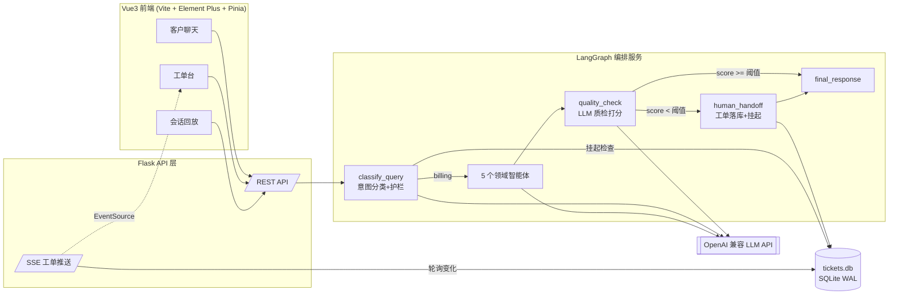
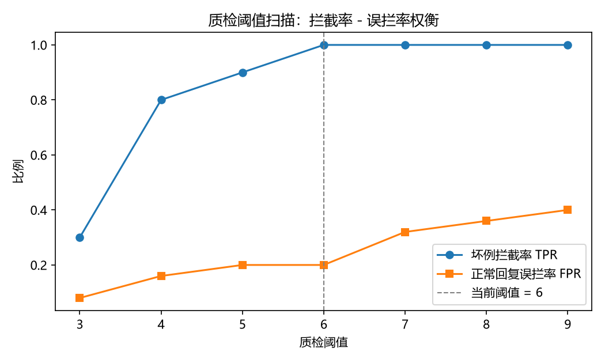

<h1 align="center">🛡️ Aegis-CS · 多智能体客服系统</h1>

<p align="center"><em>神盾 = 质检节点：在 AI 回答送达客户之前，先由另一个 AI 把关</em></p>

<p align="center">
  <a href="LICENSE"></a>
  <a href="#"></a>
  <a href="#"></a>
  <a href="#"></a>
  <a href="#"></a>
</p>

<p align="center"><em>LLM 质检打分 · 低分自动转人工 · 工单闭环 · Vue3 坐席工作台 · 决策轨迹回放</em></p>

面向电商售前售后场景的多智能体客服系统：以 LangGraph 编排"意图分类 → 领域专家智能体 → 回复质检 → 人工接管"的完整客服工作流，配套 **Vue3 坐席工作台、SSE 实时推送与决策轨迹回放**，构成"AI 先答、AI 自审、人工兜底"的质量链路。

```
客户提问 → 意图分类 → 领域智能体作答 → 回复质检打分 ─┬─ 高分放行 → 客户
                                                    └─ 低分驳回 → 工单落库 → 会话挂起 → 坐席处理 → 写回上下文 → AI 恢复接管
```

## 为什么需要质检节点

大模型客服最大的风险不是"答不出"，而是**一本正经地编造**。当客户询问"退款进度"这类系统内没有真实订单数据的问题时，业务智能体倾向于生成看似合理的编造式回答（虚构"3-5 个工作日到账"等承诺）。本系统在业务智能体之后插入独立的 LLM-as-judge 质检节点，按**相关性 / 解答度 / 可信度**三个维度对回答打 0-10 分，编造具体承诺的回答会被判 0-2 分并自动转入人工通道——实测中该机制确实拦截了业务智能体的幻觉回答。

## 功能总览

### 核心编排能力
- LangGraph 状态图编排：意图分类节点按 6 类标签条件路由到产品 / 技术 / 账单 / 投诉 / 综合客服 5 个领域智能体
- 越狱与范围外请求护栏（`out_of_scope` 固定话术拦截，不消耗业务智能体调用）
- 多轮对话记忆：checkpointer 持久化对话状态，跨请求续聊

### 增强能力

| 能力 | 说明 |
|---|---|
| **回复质检节点** | LLM-as-judge 对"用户问题 + AI 回答 + 上下文"打 0-10 分；解析容错（JSON → 正则 → 兜底）；**fail-open**：质检自身故障按满分放行，不会把全部会话误转人工；阈值支持环境变量与单次请求 `configurable.quality_threshold` 双通道覆盖 |
| **人工接管闭环** | 低分回答作为**草稿**存入工单（不下发给用户），线程挂起；挂起期间新消息不再消耗 LLM 调用；坐席提交回复后经线程状态写回注入对话上下文，AI 恢复接管且能引用人工结论 |
| **工单队列** | SQLite（WAL 模式）双进程共享：LangGraph 图进程写单，Flask 进程读单/关单，单一事实来源 |
| **Vue3 坐席工作台** | 客户聊天 / 工单台 / 会话回放三个页面；工单抽屉内可直接采纳或修改草稿提交；Flask 退化为纯 API + SPA 托管，前后端分离 |
| **SSE 实时推送** | 新工单产生即推送（EventSource 自动重连），坐席端角标计数 + 通知提醒 |
| **决策轨迹回放** | 每轮对话的意图分类、质检得分与理由、转人工/挂起/放行决策快照持久化，回放页时间线可视化 |

## 架构



## 快速开始

### 入口与角色

- **客户咨询**：`http://localhost:5000/chat`（无需登录）
- **坐席登录**：`http://localhost:5000/agent/login`（默认账号 `agent` / `aegis-demo`，口令可用 `AGENT_DEFAULT_PASSWORD` 修改）
- **坐席处理台**：`/agent/inbox`；**会话复盘**：`/agent/review`

### 本地运行

```bash
git clone https://github.com/Augustking/aegis-cs.git
cd aegis-cs

# 后端（Python 3.10+）
python -m venv .venv
.venv\Scripts\pip install -r requirements.txt
copy env_example.txt .env        # 填入 OPENAI_API_KEY（硅基流动 / 智谱等 OpenAI 兼容服务均可）

# 前端（Node 18+）
cd frontend
npm install
npm run build
cd ..

# 启动（单服务：LangGraph 图内嵌于 Flask，无独立编排服务）
.venv\Scripts\python.exe web_app.py
```

### Docker 部署

```bash
copy env_example.txt .env && rem 填入 OPENAI_API_KEY
docker compose up -d
```

数据（工单/账号/对话检查点）落在 `app-data` 卷；可选 PostgreSQL：`docker compose --profile postgres up -d`（并按 `CHECKPOINT_DB` 文档指向 DSN）。

开发前端可用 `cd frontend && npm run dev`（5173 端口，API 自动代理）。

> Windows 一键启动脚本见 `scripts/start_services.bat`（含端口检测，防止重复启动）。

### 关键配置（.env）

| 变量 | 默认 | 说明 |
|---|---|---|
| `OPENAI_API_KEY` / `OPENAI_BASE_URL` / `OPENAI_MODEL` | 硅基流动 / Qwen | 任意 OpenAI 兼容服务 |
| `CLASSIFY_MODEL` | 同主模型 | 意图分类专用模型（可配轻量档降延迟） |
| `JUDGE_MODEL` / `JUDGE_TIMEOUT` | 同主模型 / 120s | 质检 judge 专用模型与超时 |
| `QUALITY_THRESHOLD` | `8.0` | 质检放行阈值（经扫描定标）；`0` 表示仅记录不拦截 |
| `QUALITY_CHECK_ENABLED` | `true` | 质检开关（关闭后全部放行） |
| `RUN_WAIT_LIMIT` | `180` | 单轮对话等待上限，超时降级为转人工工单 |
| `TICKET_DB_PATH` / `AUTH_DB_PATH` / `CHECKPOINT_DB` | 项目根 | SQLite 数据文件位置；`CHECKPOINT_DB` 支持 postgres DSN |

## API 一览

| 方法 | 路径 | 说明 |
|---|---|---|
| POST | `/api/chat` | 发送客户消息（支持 SSE 流式 `/api/chat/stream`） |
| GET/DELETE | `/api/sessions` | 会话列表 / 删除；`GET /api/sessions/<id>` 含对话历史与决策轨迹 |
| GET | `/api/tickets?status=open\|resolved` | 工单队列 |
| GET | `/api/tickets/<id>` | 工单详情（草稿回复、质检理由） |
| POST | `/api/tickets/<id>/resolve` | 坐席处理：写回会话 + 关闭工单（写回失败自动降级） |
| GET | `/api/tickets/stream` | SSE 工单变更推送 |

## 评测结果

自建评测集（`evals/eval_set.json`）：30 题意图分类集（六桶 × 5，覆盖产品/技术/账单/投诉/一般咨询/护栏）+ 10 条构造坏例集（编造承诺、答非所问、荒谬建议等六类缺陷）+ 25 题真实链路运行。评测脚本 `evals/run_eval.py` 支持断点续跑，一条命令复现全部数字：

```bash
python evals/run_eval.py all    # 分类 → 坏例打分 → 真实链路 → 阈值扫描报告
```

| 指标 | 数值 | 说明 |
|---|---|---|
| 意图分类准确率 | **96.7%**（29/30） | out_of_scope 桶 5/5；唯一错题为"补发赠品投诉"类跨域语义 |
| 坏例拦截率（阈值 8） | **90%**（9/10） | 10 条构造坏例，接地质检拦截 9 条 |
| 正常回复误拦率（阈值 8） | **32%**（8/25） | 阈值 6 时为 12%——拦截与误拦的权衡见下表 |
| 单轮延迟 | p50 **27s** / p95 116s | 每轮 3 次 LLM 调用（分类 + 应答 + 质检），串行 |

**阈值扫描（拦截率 - 误拦率权衡）**：

| 阈值 | 3 | 4 | 5 | 6 | 7 | 8 | 9 |
|---|---|---|---|---|---|---|---|
| 坏例拦截率 TPR | 30% | 30% | 40% | 60% | 80% | 90% | 90% |
| 正常误拦率 FPR | 4% | 8% | 12% | 12% | 28% | 32% | 40% |



**定标结论**：默认阈值经扫描从 6 定标到 8——坏例拦截率 60%→90%，代价是误拦率 12%→32%。这是非对称代价决策：漏放一条编造承诺会引发售后纠纷，多转一单人工只是坐席多处理一单，宁高勿低。

**接地质检（grounded judging）**：质检节点复用业务 Agent 检索到的数据上下文，faithfulness 维度必须"对照证据"判定——证据中无依据的具体承诺（到账时间、订单状态等）计 0 分，并触发**一票否决**（不看总分直接转人工）。这一设计源于实测教训：无接地的 LLM-as-judge 对编造回复给出满分（它无法分辨"答得自信"与"答得真实"）；接入证据后，编造回复的 faithfulness 被正确压到 0。

**已知局限**：judge（Qwen3-8B，关闭思维链）对"荒谬建议"类坏例仍有漏拦；证据缺失的业务域 faithfulness 退化为常规语义判断。评测脚本与全部中间结果随仓库交付，数字可复现。

## 测试与验收

- `pytest tests/`：27 个单元/集成测试（工单 CRUD、质检解析容错、四条图路径的决策轨迹、SSE 事件、SPA 路由）
- `python deploy_verify.py`：端到端验收剧本（正常放行 / 强制转人工 / 挂起等待 / 人工处理恢复四场景），质量阈值经 `configurable` 注入，不依赖 LLM 输出的随机性

## License

[Apache-2.0](LICENSE)
