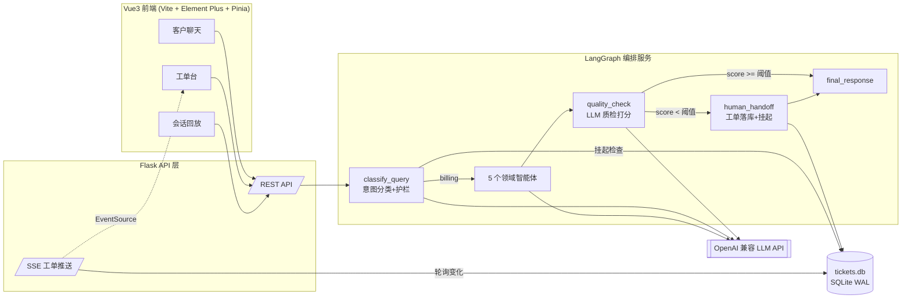

<h1 align="center">多智能体客服系统 · 质检与人工接管增强版</h1>

<p align="center">
  <a href="LICENSE"></a>
  <a href="#"></a>
  <a href="#"></a>
  <a href="#"></a>
  <a href="#"></a>
</p>

<p align="center"><em>LLM 质检打分 · 低分自动转人工 · 工单闭环 · Vue3 坐席工作台 · 决策轨迹回放</em></p>

基于开源项目 [handsomestWei/customer-service-ai-agent](https://github.com/handsomestWei/customer-service-ai-agent)（Apache 2.0）深度二次开发的多智能体客服系统。在原有"意图分类 + 领域专家智能体"编排之上，新增**回复质检、人工接管闭环、Vue3 坐席工作台、SSE 实时推送与决策轨迹回放**，形成一条完整的生产级客服工作流：

```
客户提问 → 意图分类 → 领域智能体作答 → 回复质检打分 ─┬─ 高分放行 → 客户
                                                    └─ 低分驳回 → 工单落库 → 会话挂起 → 坐席处理 → 写回上下文 → AI 恢复接管
```

## 为什么需要质检节点

大模型客服最大的风险不是"答不出"，而是**一本正经地编造**。当客户询问"退款进度"这类系统内没有真实订单数据的问题时，业务智能体倾向于生成看似合理的编造式回答（虚构"3-5 个工作日到账"等承诺）。本系统在业务智能体之后插入独立的 LLM-as-judge 质检节点，按**相关性 / 解答度 / 可信度**三个维度对回答打 0-10 分，编造具体承诺的回答会被判 0-2 分并自动转入人工通道——实测中该机制确实拦截了业务智能体的幻觉回答。

## 功能总览

### 基础能力（来自上游项目）
- LangGraph 状态图编排：意图分类节点按 6 类标签条件路由到产品 / 技术 / 账单 / 投诉 / 综合客服 5 个领域智能体
- 越狱与范围外请求护栏（`out_of_scope` 固定话术拦截，不消耗业务智能体调用）
- 多轮对话记忆：checkpointer 持久化对话状态，跨请求续聊

### 本次二次开发新增

| 能力 | 说明 |
|---|---|
| **回复质检节点** | LLM-as-judge 对"用户问题 + AI 回答 + 上下文"打 0-10 分；解析容错（JSON → 正则 → 兜底）；**fail-open**：质检自身故障按满分放行，不会把全部会话误转人工；阈值支持环境变量与单次请求 `configurable.quality_threshold` 双通道覆盖 |
| **人工接管闭环** | 低分回答作为**草稿**存入工单（不下发给用户），线程挂起；挂起期间新消息不再消耗 LLM 调用；坐席提交回复后经线程状态写回注入对话上下文，AI 恢复接管且能引用人工结论 |
| **工单队列** | SQLite（WAL 模式）双进程共享：LangGraph 图进程写单，Flask 进程读单/关单，单一事实来源 |
| **Vue3 坐席工作台** | 客户聊天 / 工单台 / 会话回放三个页面；工单抽屉内可直接采纳或修改草稿提交；Flask 退化为纯 API + SPA 托管，前后端分离 |
| **SSE 实时推送** | 新工单产生即推送（EventSource 自动重连），坐席端角标计数 + 通知提醒 |
| **决策轨迹回放** | 每轮对话的意图分类、质检得分与理由、转人工/挂起/放行决策快照持久化，回放页时间线可视化 |

## 架构



## 快速开始

```bash
git clone https://github.com/Augustking/customer-service-ai-agent.git
cd customer-service-ai-agent

# 后端（Python 3.10+）
python -m venv .venv
.venv\Scripts\pip install -r requirements.txt "langgraph-cli[inmem]" colorama
copy env_example.txt .env        # 填入 OPENAI_API_KEY（硅基流动 / 智谱等 OpenAI 兼容服务均可）

# 前端（Node 18+）
cd frontend
npm install
npm run build
cd ..

# 启动（两个终端）
.venv\Scripts\langgraph.exe dev --no-browser --port 2024   # 编排服务
.venv\Scripts\python.exe web_app.py                         # Web 服务
```

访问 `http://localhost:5000`。开发前端可用 `cd frontend && npm run dev`（5173 端口，API 自动代理）。

> Windows 一键启动脚本见 `scripts/start_services.bat`（含端口检测，防止重复启动）。

### 关键配置（.env）

| 变量 | 默认 | 说明 |
|---|---|---|
| `OPENAI_API_KEY` / `OPENAI_BASE_URL` / `OPENAI_MODEL` | 硅基流动 / Qwen | 任意 OpenAI 兼容服务 |
| `QUALITY_THRESHOLD` | `6.0` | 质检放行阈值，低于即转人工 |
| `QUALITY_CHECK_ENABLED` | `true` | 质检开关（关闭后全部放行） |

## API 一览

| 方法 | 路径 | 说明 |
|---|---|---|
| POST | `/api/chat` | 发送客户消息（支持 SSE 流式 `/api/chat/stream`） |
| GET/DELETE | `/api/sessions` | 会话列表 / 删除；`GET /api/sessions/<id>` 含对话历史与决策轨迹 |
| GET | `/api/tickets?status=open\|resolved` | 工单队列 |
| GET | `/api/tickets/<id>` | 工单详情（草稿回复、质检理由） |
| POST | `/api/tickets/<id>/resolve` | 坐席处理：写回会话 + 关闭工单（写回失败自动降级） |
| GET | `/api/tickets/stream` | SSE 工单变更推送 |

## 测试与验收

- `pytest tests/`：27 个单元/集成测试（工单 CRUD、质检解析容错、四条图路径的决策轨迹、SSE 事件、SPA 路由）
- `python deploy_verify.py`：端到端验收剧本（正常放行 / 强制转人工 / 挂起等待 / 人工处理恢复四场景），质量阈值经 `configurable` 注入，不依赖 LLM 输出的随机性

## 二次开发说明

本仓库基于 [handsomestWei/customer-service-ai-agent](https://github.com/handsomestWei/customer-service-ai-agent)（Apache 2.0）二次开发，遵循原许可证。相比上游的主要改动：

- 新增质检节点 / 人工接管节点 / 工单存储 / SSE 推送 / 决策轨迹（设计与实现文档见 `docs/superpowers/`）
- 新增 `frontend/` Vue3 应用，Flask 改为纯 API + SPA 托管（替换原 Jinja 模板页）
- 兼容性修复：新版 langchain-community 移除 MongoDB 历史类的按需加载、Windows colorama 依赖、账单智能体兜底匹配的索引越界

## License

Apache 2.0（继承自上游项目）
